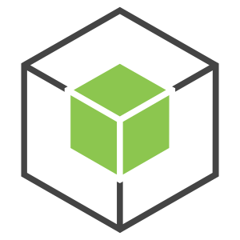

  
  
 

### 
I'm Ronit, a Full Stack Web Developer

- 🔭 I’m currently working as an intern at [Mitra Fintech](https://github.com/mitra-Fintech)

- 🌱 I’m currently learning React JS

 

## My Skill Set

<table><tr><td valign="top" width="33%">

<h3> Frontend </h3>

  
  
  

  
  

</td><td valign="top" width="33%">

<h3> Backend </h3>

  
  
  
  
  
  
  
  

 

</td><td valign="top" width="33%">

<h3> Programming Languages </h3>

  
  
  
  

</td></tr></table>

 

## Languages Used

   

 

## Coding Activity

   

 

## My Recent Commits

<!-- START:github_activity -->
<table><tr><td><b>Commit</b></td><td><b>Repository</b></td><td><b>Commit Head</b></td></tr>
</table>

<!-- END:github_activity -->

 

## Connect with me

  

  

 

## Github Stats

   

## Sponsor My Projects

   

<!--

 -->

 

