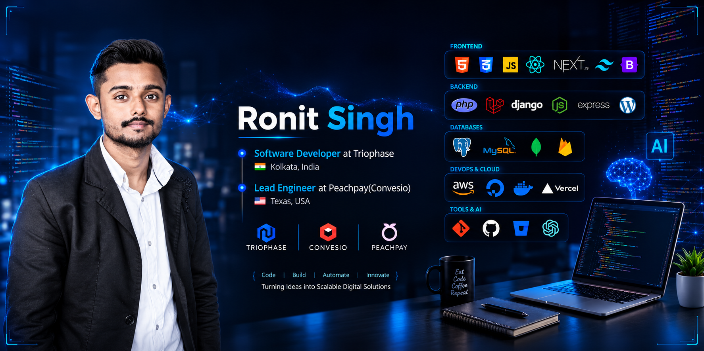

<div align="center">



</div>

<div align="center">

[](https://git.io/typing-svg)

</div>

<br/>

<div align="center">

[](https://www.linkedin.com/in/imronit/)
[](https://twitter.com/imronit1703)
[](https://github.com/imronit2001)
[](https://imronit2001.github.io/ronit/)

</div>

<br/>

---

## 👋 About Me

I'm a **Full Stack Engineer** based in **Kolkata, India 🇮🇳**, building products for **US-based companies 🇺🇸**. Currently at **Convesio**, where I work across two high-impact products — a managed WordPress hosting platform and **PeachPay**, a WooCommerce checkout solution used by thousands of merchants worldwide.

I've spent 4+ years going deep on **PHP/Laravel, React, Node.js, and payment systems** — and recently leveled up by weaving **AI tools into every stage of my engineering workflow**. I don't just write code; I build systems that scale, ship features that stick, and debug problems that matter.

```typescript
const ronit = {
  roles:      [
    "Software Developer @ Triophase 🇮🇳 · Kolkata",
    "Lead Engineer @ PeachPay (Convesio) 🇺🇸 · Texas"
  ],
  focus:      ["Payment Systems", "SaaS Architecture", "AI-First Engineering"],
  currentlyBuilding: ["Convesio Protect", "PeachPay Checkout", "Fintello"],
  aiToolchain: ["Cursor", "GitHub Copilot", "Claude", "v0"],
  motto:      "Code · Build · Automate · Innovate 🚀"
};
```

---

## 🏢 Experience

**Convesio** · Lead Engineer *(2024 – Present)*
> Full-stack development on managed WordPress infrastructure & PeachPay — a WooCommerce payment gateway handling thousands of daily transactions. Focused on checkout performance, payment reliability, and DX.

**Triophase Global** · Software Engineer *(2022 – Present)*
> Leading development of client-facing SaaS products. Notable projects include **Fintello** — a fintech platform with core banking features, transaction flows, wallets, and real-time financial dashboards — alongside a copy trading platform and multi-tenant college ERP.

**Nextgen Techno Ventures Private Limited** · Junior Developer *(2021 – 2022)* · Mumbai (Remote from Kolkata)
> Foundation years — REST APIs, database design, and production deployments.

---

## 🛠️ Tech Stack

### Frontend


### Backend


### Databases


### DevOps & Cloud


### Tools & AI


---

## 📊 GitHub Stats

<div align="center">


</div>

<div align="center">

[](https://git.io/streak-stats)

</div>

---

## 🚀 Featured Projects

| Project | Description | Stack |
|--------|-------------|-------|
| **[PeachPay](https://peachpay.app)** | WooCommerce checkout gateway · thousands of merchants | PHP, React, Stripe API |
| **Fintello** | Fintech platform with wallet, transactions & analytics | Laravel, React, MySQL |
| **Copy Trading Platform** | Real-time trade mirroring with live dashboards | Node.js, MongoDB, WebSockets |
| **[Spark Quest 3.0](https://sparkquest.live)** | Ed-tech platform with gamified learning | Laravel, Bootstrap, JS |
| **TIH College Space** | Multi-tenant college management ERP | PHP, Bootstrap |
| **TaskCraft** | Cross-platform todo app | React Native |

---

## 🎯 What I'm Focused On

- ⚡ **Payment Engineering** — building reliable, fast checkout flows that convert
- 🤖 **AI-First Development** — integrating LLMs and AI tooling into real product workflows
- ☁️ **SaaS Architecture** — multi-tenant systems, managed infra, and scalable backends
- 📦 **WordPress Ecosystem** — deep expertise in WooCommerce, plugins, and managed hosting

---

## 📜 Certifications

<details>
<summary>View All Certifications (16)</summary>

- 🏅 A Job Ready Bootcamp in C++, DSA, IoT — **iNeuron**
- ☕ Java SE — **MySirG**
- 📈 Digital Marketing — **NPTEL**
- 🐍 The Joy of Computing using Python — **NPTEL**
- 🐍 Programming for Everybody: Python — **Coursera**
- 🐍 Python Data Structures — **Coursera**
- 📊 Python and Statistics for Financial Analysis — **Coursera**
- 🤖 AI for Everyone — **Coursera**
- 📉 A Crash Course in Data Science — **Coursera**
- 🌐 Introduction to HTML5 — **Coursera**
- 🎨 Introduction to CSS3 — **Coursera**
- ⚙️ Interactivity with JavaScript — **Coursera**
- 📱 Responsive Website Basics — **Coursera**
- 📱 Advanced Styling with Responsive Design — **Coursera**
- 🐍 Capstone: Retrieving, Processing & Visualizing Data with Python — **Coursera**
- 💻 Basic Computer — **Youth**

</details>

---

<div align="center">

### 💬 Let's Connect

I'm open to interesting engineering conversations, collaboration, and opportunities at product-first companies.

[](mailto:ronit.singh@convesio.com)
[](https://instagram.com/ronitsinghrajput7)

<br/>


</div>
