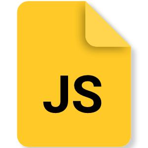

# 👋 Hi, I'm RONIT SINGH

I am a passionate Full Stack Web Developer with over 2 years of experience. Currently, I am working as a Software Developer at Triophase Global Pvt Ltd.

## 🎓 Education

| Degree   | Institution                    | Year | University | CGPA |
|----------|--------------------------------|------|------------|------|
| M.C.A    | Techno College Hooghly         | 2024 | M.A.K.A.U.T| 9.13 |
| B.C.A    | Techno India Hooghly Campus    | 2022 | M.A.K.A.U.T| 9.71 |

## 🛠️ Technical Skills

<table><tr><td valign="top" width="33%">

<h3> Frontend </h3>

  
  
  

  
  

</td><td valign="top" width="33%">

<h3> Backend </h3>

  
  
  
  
  
  
  
  

 

</td><td valign="top" width="33%">

<h3> Programming Languages </h3>

  
  
  
  

</td></tr></table>

### Programming Languages:
- C
- C++
- Java
- Python

### Web Development:
- **Frontend Development:** Html, Css, Javascript, React.JS, Next.JS, Bootstrap, Tailwind Css, Jquery
- **Backend Development:** PHP, Laravel, Django, Express Js, Node Js
- **Databases:** MySQL, MongoDB, Firebase

### DevOps:
- Git
- Github
- Linux
- Hostinger

### Microsoft Office:
- Word, Excel, Powerpoint (2007, 2013, 2019, 365)

## 💼 Work Experience

### Triophase Global Pvt Ltd. (Feb 2024 – Present)
- **Role:** Software Developer
- **Skillset:** PHP, MySQL, Next.Js, Jquery, Bootstrap, Docker

### Nextgen Techno Ventures Pvt Ltd. (May 2022 – Feb 2024)
- **Role:** PHP Intern, SDE Trainee, Web Team Lead
- **Skillset:** PHP, Laravel, Django, MySQL, Firebase, MERN, Jquery, Tailwind Css, Bootstrap
- **Responsibilities:**
  - Creating Responsive Web Pages
  - Developing Restful APIs
  - Integrating APIs
  - Database Management
  - Upgrading Codes
  - Project Deployment
  - Conducting Interviews

## 📫 How to reach me
- Email: ronitsingh7003@gmail.com
- LinkedIn: https://www.linkedin.com/in/imronit/
- Portfolio: https://imronit.in/

Feel free to explore my repositories and get in touch!
